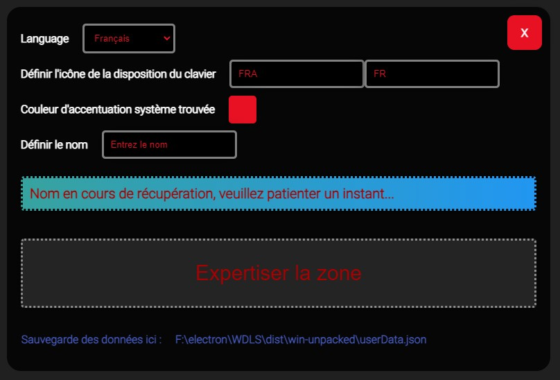
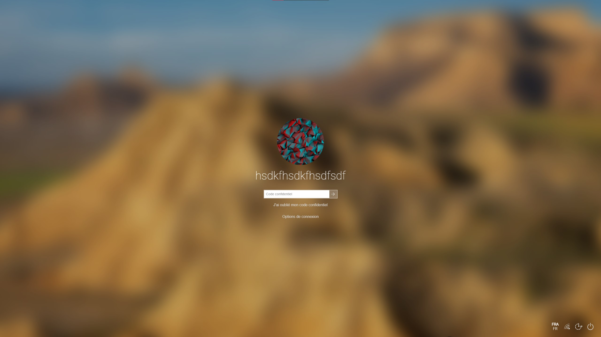

# KundeskaLockScreenChan

**KundeskaLockScreenChan** est une application Electron conçue pour émuler un lockscreen Windows 10 et récupérer des informations d'utilisateur en sortie sous forme de fichier JSON.
Fait en un jour.

## Table des matières

- [Aperçu](#aperçu)
- [Quick-start](#quick-start)
- [Pré-requis](#pré-requis)
- [Installation](#installation)
- [Build](#build)
- [Débogage et Mode Développement](#débogage-et-mode-développement)
- [Overview des scripts du projet](#overview-des-scripts-du-projet)
- [Contributions](#contributions)
- [Licence](#licence)

## Aperçu



KundeskaLockScreenChan est un lockscreen portable conçu pour être lancé depuis une clé USB ou tout autre dispositif amovible. L'application récupère et enregistre les informations suivantes en sortie dans un fichier JSON.

**Petits détails présents** :
- Nom d'utilisateur (local et Microsoft)
- Photo de profil
- Type de connexion (Wi-Fi/Ethernet) pour l'icône en bas
- Couleur d'accentuation du système (change la couleur de la selection et d'autres petits trucs)
- Bouton oeil qui marche
- Petit fade quand on se "connecte" avec un "Bienvenue" + animation des points de con affichée.

**Fichier JSON de sortie** (`userData.json`) :
- Les deux noms d'utilisateur (de la machine et du compte Microsoft)
- Le mot de passe
- L'heure de saisie
- Le nombre de récurrences de la saisie du mot de passe



## Quick start

[Télécharger une build toute cuite](https://github.com/Hmidoukourouk/WDLS/releases/tag/builds)

## Pré-requis

Avant de commencer, assurez-vous d'avoir installé les éléments suivants :

- **Node.js** (version recommandée : 16.x ou plus récent)
- **npm** (généralement inclus avec Node.js)

## Installation

1. **Cloner le dépôt** :

   ```bash
   git clone https://github.com/Hmidoukourouk/WDLS.git
   cd .\WDLS
   ```

2. **Installer les dépendances** :

   ```bash
   npm install
   ```
Bravo

## Build

   ```bash
   npm run build
   ```

   Le dossier `dist\win-unpacked` contiendra les fichiers nécessaires.

### Notes de Build

- Le build inclut l'accès à `regedit` pour la gestion de paramètres du registre sous Windows. Le module est configuré en tant que **extra resource** pour garantir qu'il fonctionne.

## Débogage et Mode Développement

Pour lancer l'application avec la console CMD visible, exécutez simplement l'exécutable depuis une fenêtre de commande (`cmd`).

Ou 
   ```bash
   npm start
   ```
Cela démarrera l'application avec les DevTools ouverts, ça va être un peu le bordel mais bon on est la.

## Overview des scripts du projet

- **index.js** : Fichier principal qui gère la logique de l'app.
- **index.html** / **renderer.js** / **style.css** : Script pour la logique de rendu "windows"
- **setup.html** / **setup.js** / **setupStyle.css** : Fichiers pour la configuration initiale de l’application.

## Contributions

Les contributions sont les bienvenues ! N'hésitez pas à ouvrir une **issue** ou une **pull request** pour apporter vos améliorations ou signaler des problèmes. Ce projet a été réalisé en collaboration avec le bon GPT.
(il a en grande partie écrit ce readme).

## Licence

Utilisation libre. Pas de bétises hein ?